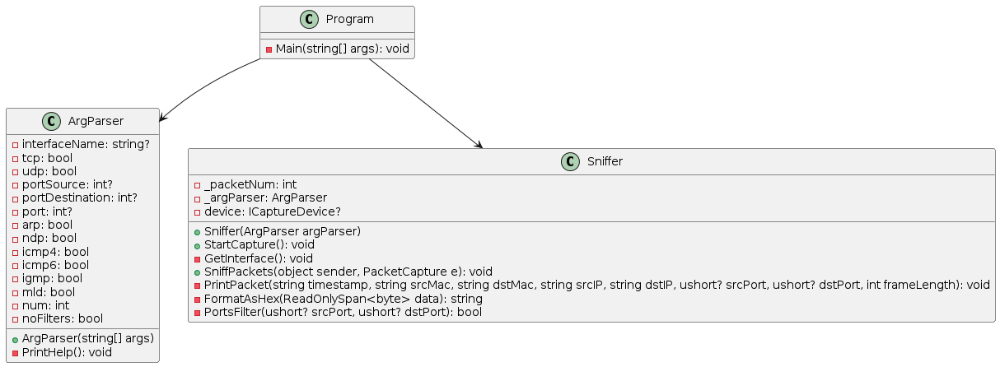

# Sniffer Project

## Introduction

The Sniffer project is a network packet analyzer, developed in C#. It is designed to capture network packets, decode them, and present their details in an easily readable format.

## Interfaces and Packets

### Interfaces

The lowest level of the TCP/IP architecture is the Network Interface layer.
It corresponds to the OSI Physical and Data Link layers.
You can use many different TCP/IP protocols at the Network Interface layer, including Ethernet and
Token Ring for LANs and protocols such as X.25, Frame Relay, and ATM for wide area networks (WANs).

### Network layer

The Network layer is where data is addressed, packaged, and routed among networks. Several important Internet protocols operate at the Network layer:

`Internet Protocol (IP):` A routable protocol that uses IP addresses to deliver packets to network devices. IP is an intentionally unreliable protocol, so it doesn’t guarantee delivery of information.

`Address Resolution Protocol (ARP):` Resolves IP addresses to hardware MAC addresses, which uniquely identify hardware devices.

`Internet Control Message Protocol (ICMP):` Sends and receives diagnostic messages. ICMP is the basis of the ubiquitous ping command.

`Internet Group Management Protocol (IGMP):` Used to multicast messages to multiple IP addresses at once.

### Transport layer

The Transport layer is where sessions are established and data packets are exchanged between hosts. Two core protocols are found at this layer:

`Transmission Control Protocol (TCP):` Provides reliable connection-oriented transmission between two hosts. TCP establishes a session between hosts, and then ensures delivery of packets between the hosts.

`User Datagram Protocol (UDP):` Provides connectionless, unreliable, one-to-one or one-to-many delivery.

## Implementation

### Sniffer Class

The `Sniffer` class is the heart of the project. It is responsible for capturing packets from the network interface. It uses the `ArgParser` class to parse command-line arguments and configure its behavior accordingly. The `Sniffer` class also includes method for filtering packets based on their source and destination ports, and for printing packet details to the console.

### ArgParser Class

The `ArgParser` class is used to parse command-line arguments. These arguments can be used to specify the network interface to listen on, the type of packets to capture, and other options. The `ArgParser` class includes a `PrintHelp` method that displays usage information to the user, making the tool easier to use.

## Bibliography

1. [Packet Analysis with Wireshark](https://www.wireshark.org/)
2. [Network Packet](https://en.wikipedia.org/wiki/Network_packet)
3. [Network Informations](https://www.dummies.com/article/technology/information-technology/networking/general-networking/network-administration-tcpip-protocol-framework-184682/)
4. [C# Programming Guide](https://docs.microsoft.com/en-us/dotnet/csharp/)
5. [Dotnet Command-line Interface (CLI)](https://docs.microsoft.com/en-us/dotnet/core/tools/)
